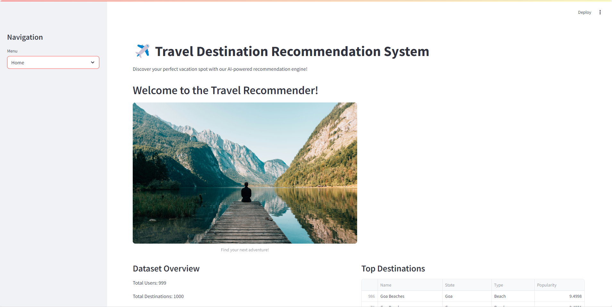

# Travel-Recommendation-System
A machine learning-based web application that suggests travel destinations based on user preferences. This system enhances the travel experience by providing personalized recommendations using various parameters like location type, climate, budget, and interests.

## 🔍 Features

- ✅ Personalized travel destination suggestions
- ✅ User-friendly interface built with Streamlit
- ✅ Data visualization of recommendations
- ✅ Machine learning model using content-based filtering
- ✅ Easy to modify and extend for more use-cases

## 📌 How It Works

1. Users input preferences (e.g., type of place, climate, activity).
2. The system processes input using a content-based recommendation engine.
3. Top recommended destinations are displayed along with key features.

## 🛠️ Tech Stack

| Technology     | Purpose                         |
|----------------|----------------------------------|
| Python         | Core logic and backend          |
| Streamlit      | Web interface                   |
| Pandas & NumPy | Data handling and processing    |
| Scikit-learn   | Model building                  |
| Seaborn & Matplotlib | Data visualization        |
| Pickle         | Model saving and loading        |

## 📷 Screenshots
> 

## 🚀 Getting Started

### 1. Clone the Repository
```bash
git clone https://github.com/ShambhaviBorkar/Travel-Recommendation-System.git
cd Travel-Recommendation-System
```
2. Install Dependencies
Make sure you have Python 3.8+ and pip installed

```bash
pip install streamlit pandas numpy scikit-learn seaborn matplotlib
```
3. Run the App
```bash
streamlit run travel_app.py
```
📂 Project Structure
```bash
Travel-Recommendation-System/
├── travel_app.py          # Main Streamlit app
├── model.pkl              # Trained recommendation model
├── destinations.csv       # Dataset used
├── assets/                # Images and visuals
└── README.md
```
📈 Future Improvements
Add login and profile history

Integrate real-time weather and cost APIs

Suggest travel packages or hotels

Improve recommendation logic with collaborative filtering

## 🙋‍♀️ Authors
Gauri Gotad

GitHub: [@Gaurigotad](https://github.com/Gaurigotad)

Shambhavi Borkar

GitHub: [@ShambhaviBorkar](https://github.com/ShambhaviBorkar)
